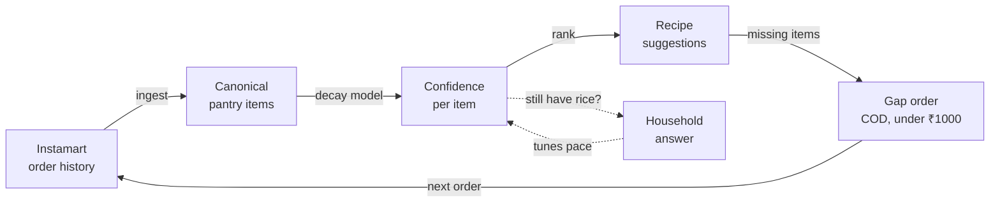
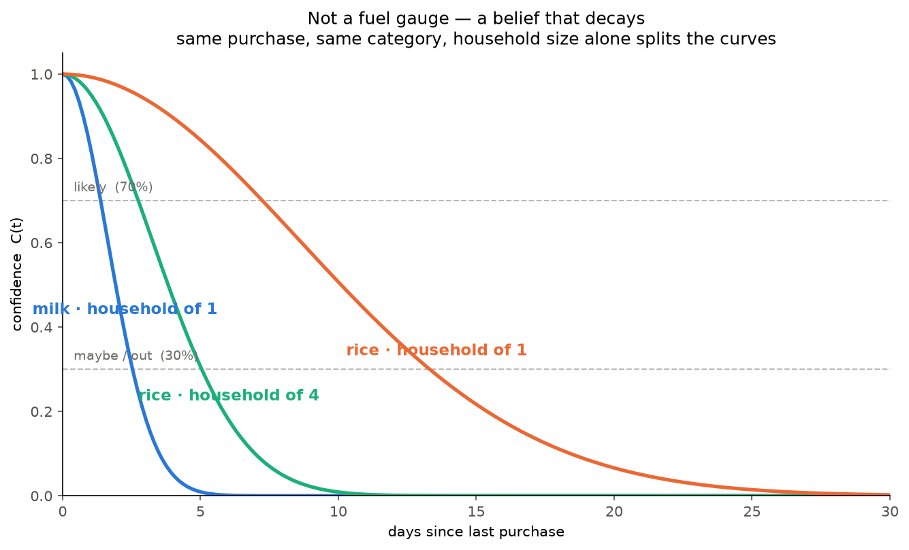
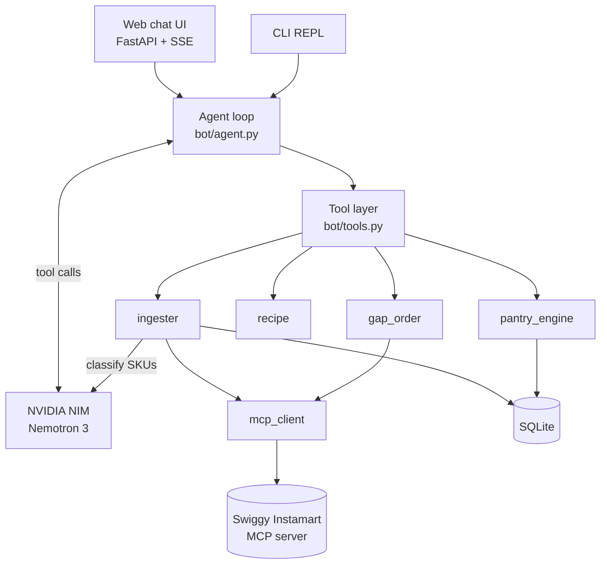

# Swiggy Jugaad

**An AI grocery agent that works out what's still in your kitchen from your
Swiggy Instamart order history, suggests what to cook with it, and orders
only the missing items.**

> Swiggy knows what enters your kitchen. This models what's still in it.


Built on the Swiggy MCP beta (Food / Instamart / Dineout) for the Swiggy
Builders Club. It places real Instamart orders against a real account.

---

## The problem

There's no pantry API. Swiggy sees every grocery order that enters a kitchen,
but nothing about what gets cooked, eaten or thrown out. So "what can I make
tonight?" and "what do I need to buy?" can't be answered from data anyone has.

Swiggy Jugaad models consumption instead of observing it. Each purchased item
gets a **confidence** that decays from the day it was bought, at a rate set by
what it is, how many people live in the house, and how fast this particular
household has turned out to use it. The agent reasons over that model, ranks
recipes by what the household probably owns, and fills the gap with a small
Instamart order after the household says yes.

## How it works



1. **Ingest.** Pull recent Instamart orders over MCP. An LLM maps raw SKU names
   like `Amul Taaza Toned Milk 500 ml` to a canonical ingredient (`milk`) and a
   decay category (`dairy`). Results go into a global cache, so each distinct
   SKU is classified once, ever, for every user.
2. **Infer.** Score every pantry item with a confidence curve based on time
   since purchase, household size and a learned per-item pace.
3. **Suggest.** Rank recipes by how much of each one the household probably
   owns, filtered to their diet, with faster dishes preferred.
4. **Gap-order.** Search Instamart for what's missing, pick the cheapest
   relevant variant, fit the basket under the ₹1000 cap, show it, and check
   out only after an explicit yes in a separate message.

Every "still have rice?" answer is a correction that sharpens the model, so a
household gets asked less often the longer it uses the app.

## The pantry model

<p align="center">
  
</p>

The chart is generated from the production scoring function, not drawn by hand.

For each item, confidence is the probability that it's still usable:

```
C(t) = 0.05 ^ (x²)        where  x = m · t / U

  t = days since last purchase
  U = usable life = min(shelf_life, typical_days / household_size^0.7)
  m = this household's pace multiplier for this item (learned, starts at 1.0)
```

The design choices that matter:

- **Squared exponent, not plain exponential decay.** Plain `exp(-t/τ)` says
  milk bought yesterday is already down to 47%, which is wrong and teaches
  users to ignore the app. With `x²` the curve holds flat while an item is
  fresh and drops off as it ages. Formally it's a Weibull survival curve with
  shape k = 2. `C` hits exactly 5% at the end of expected life, never 0.
- **Sublinear household scaling.** A family of four gets through rice about
  2.6× faster than one person, not 4×, so usable life is divided by
  `size^0.7`.
- **Two clocks.** An item runs out when it's eaten or when it spoils. Buying
  more milk can't make it last past its shelf life, but a household's own
  corrections can (say they buy UHT milk), because a direct answer beats an
  inferred default.
- **Learning from corrections.** "Ran out early" multiplies `m` by 1.2,
  "lasted longer" by 0.8, clamped to [0.2, 5.0] so one bad answer can't wreck
  the model. `m` survives repurchase, since it describes the household, not
  the pack.
- **Buckets, never assertions.** `C ≥ 0.7` is *likely*, `0.3–0.7` is *maybe*
  (the agent asks), `< 0.3` is *out* (a gap-order candidate). The model only
  ever sees the bucket and is told never to say a percentage; "you probably
  have rice" rather than "you have rice".

The full spec, with worked examples and golden test vectors, is in
[`swiggy_jugaad/pantry_engine/MATH.md`](swiggy_jugaad/pantry_engine/MATH.md).

## Interfaces

- **Web chat.** A phone-frame chat UI served by FastAPI. Each turn streams
  over server-sent events, and tool results render as cards: pantry status,
  recipes with what's missing, addresses to tap, the staged cart, the placed
  order. Next to the phone, an **under the hood** panel shows what the model
  believes (every item's decay curve and confidence) and what it's doing
  (each LLM hop and tool call, with timings, live).
- **CLI.** A plain terminal REPL driving the same agent loop.

## Architecture



| Module | Responsibility |
| --- | --- |
| `pantry_engine/` | Confidence math, buckets, corrections. Pure functions, `now` always passed in, so tests are deterministic. |
| `ingester/` | Order parsing, LLM SKU classification, global SKU cache, idempotent order ingestion. |
| `recipe/` | Recipe DB loading, diet filtering, ranking. |
| `gap_order/` | Product matching, ₹1000 cap, cart and checkout. |
| `mcp_client/` | Typed async wrappers over the Swiggy MCP tools, retries, error types. |
| `bot/` | Agent loop, tool registry and dispatch, system prompt, CLI adapter. |
| `store/` | SQLite schema and repository functions. |
| `webapp.py`, `static/` | FastAPI app, SSE endpoint, vanilla JS/CSS frontend. |

## Engineering highlights

### Guardrails around real money

Checkout places a real cash-on-delivery order, so the safety rules are
enforced in code, not only in the prompt:

- **Build and buy are separate tools.** `start_gap_order` only stages a cart.
  `confirm_gap_order` refuses if the cart was staged in the same turn, so the
  household always gets a message in which to say yes.
- **Forced pause.** After a cart is staged or an order is placed, the next LLM
  call runs with `tool_choice="none"`, so the model has to reply in text before
  doing anything else.
- **The model can't choose whose account it acts on.** `user_id` isn't in any
  tool schema; `dispatch()` binds it from the session.
- **No silent substitutions.** When an item is out of stock, up to three of
  Swiggy's suggested alternatives go back to the household to pick from or
  skip.
- **Budget cap.** Lines are added cheapest-first while they fit under ₹1000,
  and anything dropped is shown.
- **Address re-confirmation.** Addresses are fetched fresh and picked again
  for every order; there's no remembered default.

### A hand-written agent loop

No LangChain or agent framework. [`bot/agent.py`](swiggy_jugaad/bot/agent.py)
is about 200 lines of plain Python: call the LLM, run the tool calls, append
the results, repeat, up to 8 hops a turn.

- Runs as a generator of events (`llm_start`, `llm_end`, `tool_start`,
  `tool_end`, then one `reply` or `error`). The web UI streams them as SSE;
  the CLI just collects the final reply.
- A tool that raises (bad arguments, a household that isn't onboarded yet)
  hands `{"error": ...}` back to the model so it can recover in the same turn.
  Swiggy auth failures and outages end the turn with a plain message instead.
- Every `tool_call` gets a matching tool message even when a turn exits early.
  Without that, the provider rejects the next request and the conversation
  stays broken until a restart.
- Primary and fallback models, a 25 s timeout and no hidden SDK retries, so a
  stuck call fails fast. Leaked `<think>` blocks from reasoning models are
  stripped.

### Turning receipts into ingredients

A keyword matcher can't tell `Dove Milk Cream Bathing Bar` from milk, so SKU
names are classified by an LLM in batches of 40 at temperature 0.

- Output is constrained to a 67-name canonical vocabulary shared with the
  recipe DB, so `atta` and `wheat flour` can't split one ingredient into two
  half-confident pantry rows.
- Categories are decay buckets, not food groups: ghee sits with oil and sugar
  with spices, because that's how fast they leave the kitchen.
- Replies are parsed defensively (fenced JSON, stray prose, keys that don't
  match the input), with JSON mode and a second model as fallbacks.
- The SKU cache is global rather than per-user, and non-food items are cached
  too, so the same bar of soap is never classified twice.
- Only delivered orders are ingested, and each order at most once.

### Swiggy MCP client

- One-time **OAuth 2.1 + PKCE** login script (phone and OTP in the browser).
  The token's JWT expiry is read to show how many days it has left.
- Errors are typed by what the caller should do: `SwiggyAuthExpired` means log
  in again and is never retried, `SwiggyUnavailable` is retried with
  exponential backoff, and `SwiggyToolError` means the arguments were bad.
- Batched product searches share one MCP session instead of opening a
  connection per ingredient.

### Tests

78 tests that run offline in about 15 seconds. The LLM and Swiggy are both
faked, and each test gets a fresh SQLite database. They cover the golden
vectors and properties from `MATH.md`, agent loop failure paths, cap and
matching logic, recipe ranking, and the web API.

## Tech stack

| Layer | Choice |
| --- | --- |
| Language | Python 3.11, managed with [uv](https://docs.astral.sh/uv/) |
| LLM | NVIDIA NIM through the OpenAI SDK: Nemotron 3 Super 120B, with Nemotron 3 Ultra as fallback (both overridable) |
| Commerce | Swiggy Instamart over the Model Context Protocol (`mcp` Python SDK, streamable HTTP) |
| Backend | FastAPI, server-sent events, Pydantic |
| Storage | SQLite (households, pantry items, corrections, order cache, SKU cache) and a JSON recipe DB |
| Frontend | Vanilla HTML, CSS and JavaScript, no build step |
| Tests | pytest |

## Getting started

### Prerequisites

- Python 3.11 and [uv](https://docs.astral.sh/uv/getting-started/installation/)
- An NVIDIA API key from [build.nvidia.com](https://build.nvidia.com)
- A Swiggy account with Instamart delivery at one of its saved addresses

### Setup

```bash
git clone https://github.com/randomPlayerHere/swiggy_buzz.git
cd swiggy_buzz
uv sync

cp .env.example .env              # add NVIDIA_API_KEY
uv run scripts/nim_smoke_test.py  # check the LLM endpoint answers

# Swiggy has no API keys. Log in once in the browser (phone + OTP);
# the script prints a bearer token that lasts about 5 days.
uv run scripts/swiggy_login.py    # paste the token into .env as SWIGGY_ACCESS_TOKEN
```

### Run

```bash
uv run uvicorn swiggy_jugaad.webapp:app   # web chat at http://localhost:8000
uv run main.py                            # or the terminal version
```

> [!WARNING]
> Checkout is real. Confirming a cart places a cash-on-delivery Instamart
> order on the logged-in account.

### Configuration

| Variable | Required | Purpose |
| --- | --- | --- |
| `NVIDIA_API_KEY` | yes | NVIDIA NIM API key |
| `SWIGGY_ACCESS_TOKEN` | yes | Bearer token from `scripts/swiggy_login.py` |
| `SWIGGY_ORDERS_REPLAY` | no | Path to sample orders to use instead of live history (see below) |
| `NIM_MODEL`, `NIM_FALLBACK_MODEL` | no | Override the default models |
| `SWIGGY_JUGAAD_DB` | no | SQLite path, default `data/swiggy_jugaad.db` |

### Demo mode

Swiggy's MCP only returns about 15 days of order history, so an account that
hasn't ordered recently syncs an almost empty pantry. Set
`SWIGGY_ORDERS_REPLAY=data/demo_orders.json` to replay sample orders, dated
relative to today, in place of that one fetch. Classification, decay and
ranking run unchanged, and addresses, search, cart and checkout stay live. The
UI shows a "sample order history" pill while it's on.

```bash
uv run scripts/demo_preflight.py    # keys, models, token expiry, Swiggy reachable (no LLM inference spent)
uv run scripts/reset_demo_user.py   # clean slate for the web household (keeps the SKU cache)
uv run uvicorn swiggy_jugaad.webapp:app
# open http://localhost:8000/?privacy to blur street addresses for screen recordings
```

### Tests

```bash
uv run pytest
```

## Web API

| Endpoint | Description |
| --- | --- |
| `POST /api/chat/stream` | One turn as server-sent events: `llm_start`/`llm_end`, `tool_start`/`tool_end`, then `reply` or `error` |
| `POST /api/chat` | The same turn as a single JSON response |
| `GET /api/pantry` | Every pantry item with confidence, age, usable life and pace (for the UI panel only, never sent to the model) |
| `GET /api/status` | Household, Swiggy token expiry, order source, model name (makes no network calls) |
| `GET /api/greeting` | Opening message, depending on whether the household is onboarded yet |
| `POST /api/reset` | Start a new conversation; the household and pantry are kept |

## Project structure

```
├── main.py                    # CLI entrypoint
├── swiggy_jugaad/
│   ├── config.py              # env vars and product constants
│   ├── webapp.py              # FastAPI app: static UI, chat, SSE, pantry and status APIs
│   ├── static/                # chat UI and "under the hood" panel
│   ├── bot/                   # agent loop, tools, system prompt, CLI
│   ├── pantry_engine/         # decay math, buckets, corrections (+ MATH.md spec)
│   ├── ingester/              # order parsing, SKU classification, cache, replay
│   ├── recipe/                # recipe loading and ranking
│   ├── gap_order/             # matching, cap, cart and checkout
│   ├── mcp_client/            # Swiggy MCP session, wrappers, errors
│   └── store/                 # SQLite schema and repository
├── data/
│   ├── recipes.json           # recipe DB
│   └── demo_orders.json       # sample order history for demo mode
├── scripts/                   # login, preflight, demo reset, smoke tests
├── docs/                      # README assets
└── tests/
```

## Limitations and next steps

- **Pack size isn't modelled yet.** Every purchase counts as one standard pack,
  so a 5 kg bag of rice starts out predicted like a 1 kg one and takes about
  eight corrections to converge. Using purchase quantity would get there with
  none; the design is in `MATH.md` §10.
- **The model only sees purchases.** There's no "cooked it" event yet, so an
  item bought and never used still decays. Corrections and the *maybe*
  questions cover most of that gap for now.
- **Short history.** The MCP exposes about 15 days of orders, which misses
  long-lived staples bought earlier.
- **Small recipe set.** Ten Indian home-cooking recipes, and the taste-fit term
  in the ranking is still a placeholder.
- **One household per server.** There's no user login yet; the web app and CLI
  each drive a fixed household.
- **Swiggy MCP beta rules.** Immediate delivery only, cash on delivery only,
  and a ₹1000 cap per order.
- **Planned:** a Telegram or WhatsApp adapter behind the same agent loop.

---

Independent project built for the Swiggy Builders Club. Not an official
Swiggy product.
